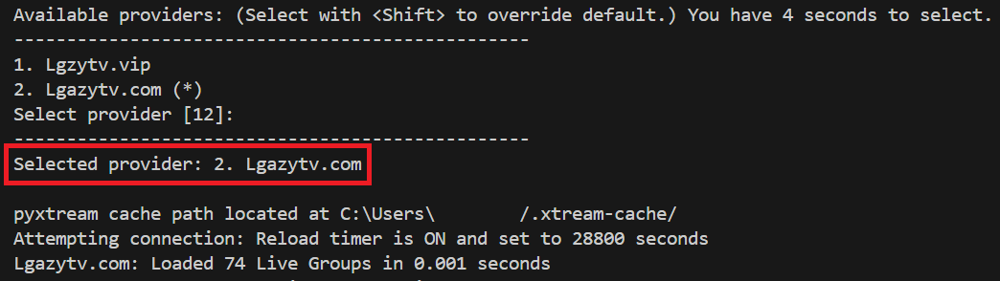

# Part 3: Functionalities

xtreamPOC includes multiple features to enhance the viewing experience, including **Automatic Provider Selection**, **Replay**, **Record**, and **Frequent Search**. These functionalities help streamline provider selection, ensure continuous streaming, and provide quick access to frequently searched terms.

## 1. Automatic Provider Selection

With xtreamPOC, you can configure multiple IPTV providers. The **Automatic Provider Selection** functionality allows you to automatically select a default provider after a specified number of seconds.

- **Purpose**: Set a default IPTV provider that will be selected automatically if no other provider is chosen within the given timeframe.
- **How it Works**:
  - Upon launching xtreamPOC, a list of available IPTV providers will be displayed.
  - You have a configurable number of seconds (as defined by `time_out` in `xtreamPOC.json`) to select a provider manually.
  - To select a different provider and override the default, press the corresponding provider number while holding the Shift key.
- **Example Output**:
  
    
  
  In this example, the system displays a list of providers, with the default provider marked by an asterisk (`*`). If no selection is made within the countdown period, the default provider is automatically chosen.

## 2. Replay

The **Replay** functionality is designed for live channels only. It is useful in cases where a stream might be unstable or experience interruptions.

- **Purpose**: Automatically restarts the stream if it stops unexpectedly.
- **How to Use**: Enable the "Replay" switch to activate this feature. When active, xtreamPOC will continuously attempt to replay the stream if it encounters interruptions.
- **Note**: The Replay function will remain active until you manually disable the "Replay" switch.

## 3. Record

The **Record** functionality allows you to record any type of stream, including live channels, movies, and series.

- **Purpose**: Save content for later viewing by recording the stream directly to your configured directory.
- **How to Use**: Enable the "Record" checkbox before streaming. This will start recording the content when playing the stream. If the stream stops unexpectedly and "Replay" is also enabled, xtreamPOC will restart the stream and continue recording.
- **Saved Files**: Recordings are saved in the path specified in the `xtreamPOC.json` configuration file. Use `mpv_rec_win` for Windows and `mpv_rec_linux` for Linux to set your recording directory.

## 4. Frequent Search

The **Frequent Search** functionality simplifies access to commonly searched terms by allowing users to quickly reselect previously used search queries.

- **Purpose**: Automatically adds frequently searched terms (searched three times or more) to a dropdown list for easy access.
- **How it Works**:
  - When you search for a specific term three times or more, it is added to the **Frequent Search** dropdown list.
  - To search for a term from this list, click the dropdown arrow and select the desired search term.
- **Usage Tips**: This feature is especially useful for terms you search for regularly, like favorite series, movies, or channels. You can quickly access them from the dropdown without retyping.

---

These features work together to make xtreamPOC a user-friendly tool. **Automatic Provider Selection** enables quick and efficient provider setup, while **Replay** and **Record** provide control over streaming reliability and recording. Finally, **Frequent Search** streamlines access to popular search terms.
